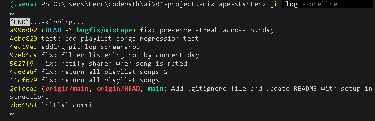

# AI Usage

I used AI during the codebase orientation phase to better understand the structure of the project before fixing any bugs. After reading the project files myself, I asked AI to explain the responsibilities of the main files and help trace how requests moved from the route layer to the service layer. This helped me build my codebase map before I started debugging.

I also used AI while investigating bugs to compare similar code paths and explain unfamiliar logic. For example, when debugging the rating notification issue, I compared the working `add_to_playlist()` function with the `rate_song()` function to identify why one created notifications while the other did not.

I verified the AI's suggestions by reproducing each bug myself using the Flask endpoints, reading the relevant source code, and confirming the behavior before making any changes. One example where I had to verify the AI's guidance was when I initially attempted to reproduce the playlist bug using `/playlists/1`. After inspecting the database through the Python shell, I discovered the application uses UUIDs rather than numeric IDs, so I adjusted my testing accordingly.

---

# Codebase Map

## Main Files

- **app.py** creates the Flask application, configures the database, and registers all route blueprints.
- **models.py** defines the SQLAlchemy models used throughout the application, including users, songs, playlists, listening events, ratings, notifications, and the association tables between songs, playlists, and tags.
- **routes/** contains the API endpoints. Each route validates request data, calls the appropriate service function, and returns a JSON response.
- **services/** contains the application's business logic. Each service focuses on a specific feature such as playlists, notifications, searching, listening streaks, or feed generation.
- **seed_data.py** recreates and populates the database with users, songs, playlists, listening history, ratings, and notifications for testing.
- **tests/** contains automated tests for several application features.

## Data Flow Example

When a user requests a playlist's songs, the request first reaches `routes/playlists.py` through the `GET /playlists/<playlist_id>/songs` endpoint. That route calls `get_playlist_songs()` in `services/playlist_service.py`. The service queries the playlist entries table, joins it with the `Song` model, orders the songs by their playlist position, converts each song into a dictionary using `to_dict()`, and returns the results. The route then formats the response as JSON and sends it back to the client.

## Architecture Pattern

The application follows a clear separation of responsibilities. The route files remain lightweight by handling request validation and response formatting, while nearly all business logic lives inside the service layer. Database access is performed through SQLAlchemy models, allowing multiple routes to reuse the same service functions.

---

# Root Cause Analysis
## Issue #5 – The last song in a playlist never shows up

### How I reproduced it

I started the Flask app and opened the playlist detail endpoint for the Friday Energy playlist:

GET /playlists/fa64daf5-02fc-486a-8b60-480630772183

The playlist detail showed `song_count: 7`.

Then I opened:

GET /playlists/fa64daf5-02fc-486a-8b60-480630772183/songs

That endpoint returned `count: 6`, which confirmed the bug because the playlist said it had 7 songs but only 6 were returned.

### How I found the root cause

I started from the endpoint GET /playlists/<playlist_id>/songs, then looked at routes/playlists.py to see which service function it called. That led me to get_playlist_songs() in services/playlist_service.py. The query itself returned the playlist songs in position order, but the return statement used songs[:-1], which removes the final song from the list.

### The root cause

The get_playlist_songs() function was slicing the song list with songs[:-1]. In Python, that returns every item except the last one. Since the playlist songs were already ordered by position, the last item was always the most recently added song. This caused the newest playlist song to be hidden every time.

### My fix and check

I changed the return statement from songs[:-1] to songs so the function returns every song in the playlist. After the fix, I refreshed the Friday Energy playlist songs endpoint and confirmed the count changed from 6 to 7, matching the playlist detail endpoint. I also confirmed that the songs were still returned in playlist order because the query continued ordering by `playlist_entries.position`.

---

## Issue #4 – Rating notifications

### How I reproduced it

I traced the rating endpoint from routes/songs.py. The route POST /songs/<song_id>/rate calls rate_song() in services/notification_service.py.

Before changing the code, I rated a song shared by another user and then checked the original sharer's notifications endpoint:

GET /users/<shared_by_user_id>/notifications

The rating was saved, but no notification appeared, which matched the reported issue.

### How I found the root cause

I compared the working playlist notification path to the rating path in services/notification_service.py. The add_to_playlist() function creates a notification after adding a song to a playlist. The rate_song() function had similar user and song lookup logic, but after saving the rating it only committed and returned the rating. It never created a notification.

### The root cause

The rating logic was missing the notification creation step. The function saved or updated a Rating record, but it did not call create_notification() afterward. Because of that, the rating existed in the database, but the song sharer never received a notification.

### My fix and check

I added a create_notification() call after the rating commit, only when the rater is not the original sharer. This matches the pattern used by playlist-add notifications and avoids notifying users about their own actions. After the fix, I rated another user's song again and confirmed that the original sharer received a new `song_rated` notification. I also verified that users do not receive notifications for rating their own songs because the existing self-notification check remained in place.

---

## Issue #2 – Friends Listening Now

### How I reproduced it
I read the issue description and traced the endpoint GET /feed/<user_id>/listening-now. The issue described that users who listened late the previous evening still appeared in the "Listening Now" feed the next morning. I tested the endpoint using one of the seeded users and confirmed that the feed logic was based on a rolling time window rather than the current calendar day.

### How I found the root cause
I started with the route in routes/feed.py, which calls get_friends_listening_now() in services/feed_service.py. Inside that function, I found the cutoff time was calculated using datetime.now(timezone.utc) minus a 24-hour timedelta. That explained why listening events from yesterday evening were still included the following morning.

### The root cause
The function filtered listening events using a rolling 24-hour window (datetime.now() - timedelta(hours=24)). That allowed listening events from late the previous evening to remain visible the next morning. The feature requirements expected "Listening Now" to include only events from the current calendar day.

### My fix and check
I changed the cutoff from a rolling 24-hour window to the start of the current day by setting the cutoff time to midnight. This ensures that only today's listening events appear in the feed. I verified that the endpoint still returned today's listening events after the change while excluding events from the previous day. I also confirmed that the function continued filtering only the current user's friends, so unrelated users did not appear in the feed.
---

# Git Log Screenshot

# Regression Test

I added `tests/test_playlist_regression.py` to verify that `get_playlist_songs()` returns the same number of songs as the playlist relationship contains. This test would have failed before the Issue #5 fix because the function used `songs[:-1]`, which always removed the final song from the returned list.